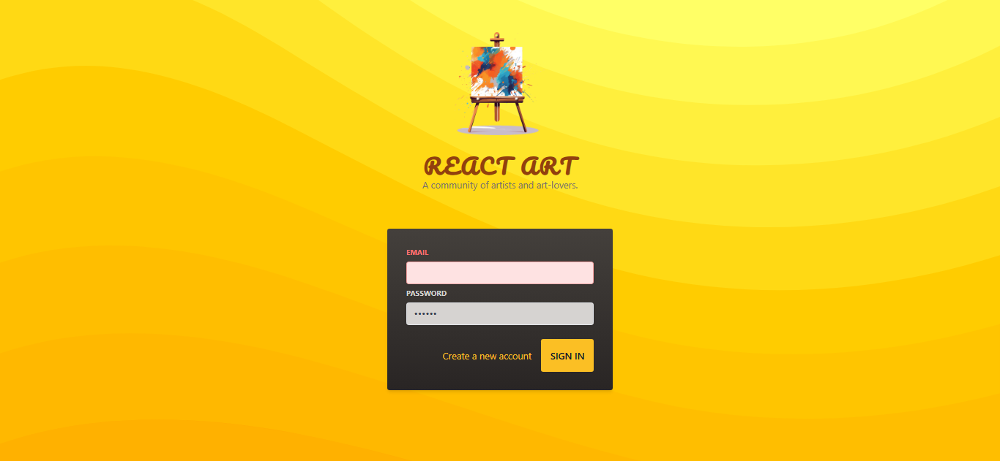

<div id="top"></div>

[](https://react.dev/)
[](https://tailwindcss.com/)


<!-- PROJECT LOGO -->
<br />
<div align="center">
  <a href="https://react-art-93f2e.web.app/">
    
  </a>
  <h1 align="center">React-Art</h1>

  <p align="center">
    <a href="https://react-art-93f2e.web.app/">View Demo</a>
    ·
    <a href="https://github.com/SalahShallapy/React-Art/issues">Report Bug</a>
  </p>
</div>

## Project Overview



This project demonstrates how to style React components using **Styled Components** and **Tailwind CSS**. It showcases a simple application with:

- A `Header` component styled using **Tailwind CSS**.
- An `AuthInputs` form demonstrating user interaction, validation, and modern styling techniques.

## Features

1. **Header Component**:

   - Displays a logo, title, and description.
   - Styled using **Tailwind CSS** for responsive and utility-based styling.

2. **AuthInputs Component**:

   - Includes email and password inputs with validation.
   - Uses reusable styled `Input` and `Button` components for consistency.

3. **Styling Techniques**:
   - **Tailwind CSS**: For rapid and utility-first styling.
   - **Styled Components**: For scoped, component-specific styling.

## Learning Objectives

- Understand utility-based styling with Tailwind CSS.
- Learn scoped component styling with Styled Components.
- Practice structuring reusable and maintainable React components.

## File Structure

```
React-Art
│
│      .gitignore
│      .vite.config
│      index.html
│      package-lock.json
│      package.json
│      README.md
│      postcss.config.js
│      tailwind.config.js
│
└───public
│
│   vite.svg
│   logo.png
│   OverView.png
│
└───src
    │   App.jsx
    │   main.jsx
    │   index.css
    │   Header.css
    │
    ├───assets
    │       logo.png
    │
    ├───components
    │     AuthInputs.jsx
    │     Button.jsx
    │     Header.jsx
    │     Input.jsx
    │
```

## Installation

To get started with the project locally:

1. Clone the repository:
   ```bash
   git clone https://github.com/SalahShallapy/React-Art.git
   ```
2. Navigate to the project directory:
   ```bash
   cd React-Art
   ```
3. Install dependencies:
   ```bash
   npm install
   ```
4. Run the project:
   ```bash
   npm run dev
   ```

## Contributing

Contributions are what make the open source community such an amazing place to learn, inspire, and create. Any contributions you make are **greatly appreciated**.

If you have a suggestion that would make this better, please fork the repo and create a pull request. You can also simply open an issue with the tag "enhancement".
Don't forget to give the project a star! Thanks!

1. Fork the Project
2. Create your Feature Branch (`git checkout -b feature/AmazingFeature`)
3. Commit your Changes (`git commit -m 'Add some AmazingFeature'`)
4. Push to the Branch (`git push origin feature/AmazingFeature`)
5. Open a Pull Request

<p align="right">(<a href="#top">back to top</a>)</p>
